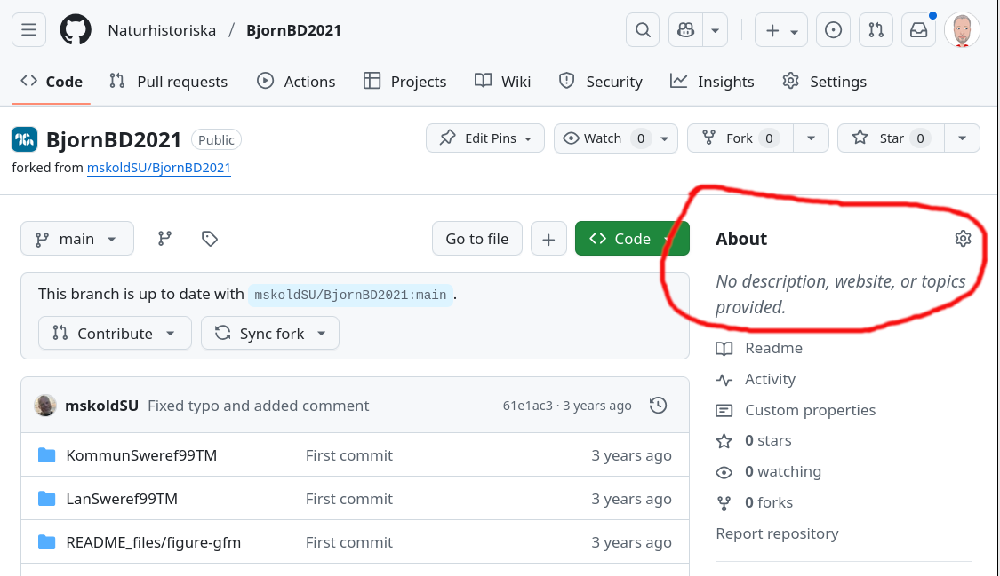

# README.md

- Last modified: fre sep 26, 2025  10:05
- Sign: nylander

## Description

For now (Sept 2025), the web page is rendered directly from the root [README.md](../README.md).

To update that (only content: list of public repositories), run the steps below.

1. Make sure public repos have some text in the About field:

2. Run the script `Naturhistoriska.github.io/_scripts/list_public_repos_in_naturhistoriska.py`

3. Add the output to `Naturhistoriska.github.io/README.md`

4. git add, commit, push
